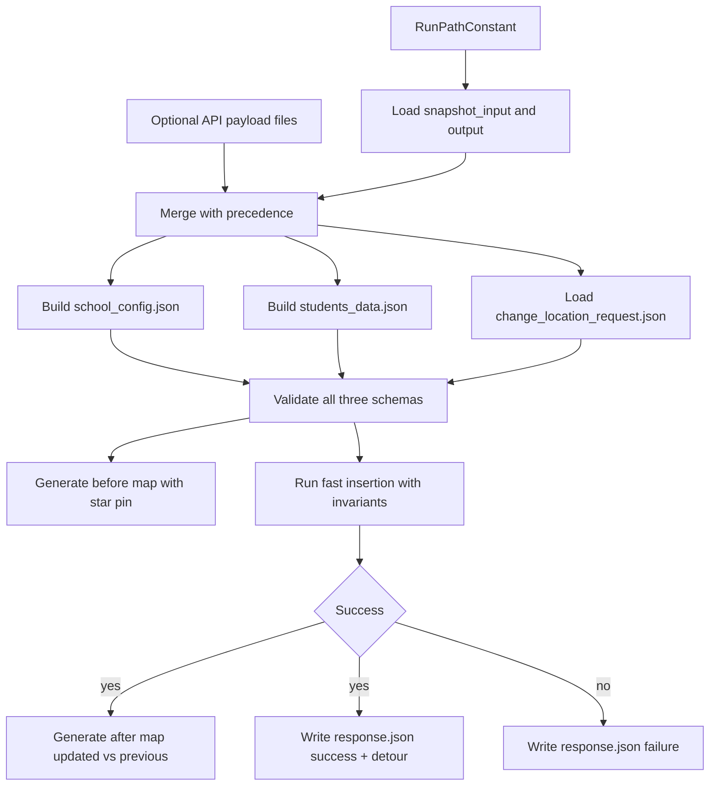

# Refactor plan for `api_new` change-location flow

## What I understood
You want a runnable script in `api_new` where you can paste one command (kept in a comment) and set top-level constants for inputs (especially a selected full-run relative path). The script should orchestrate three inputs/contracts:
- `school_config` (minimal admin-editable subset; seeded from run input until API updates exist)
- `change_location_request`
- `students_data` (routes -> stops -> students full data)

You also want:
- API request payloads to override run-derived data when provided
- always-generated “before” map (star pin on comparison map)
- “after” map on success (updated route comparison)
- response JSON with success/failure and detour minutes
- strict guarantee that no student except requested `student_id` is moved or dropped
- fast heuristic path update (lightweight insertion / optional local 2-opt)

## What I found (current codebase)
- Existing processor in [`c:/Users/phx25/Desktop/Grad Project/Bus-Logistics-Tool-Crossings/process_change_location_request.py`](c:/Users/phx25/Desktop/Grad%20Project/Bus-Logistics-Tool-Crossings/process_change_location_request.py) already has a fast insertion flow and map generation.
- The likely “students disappeared” issue is not direct deletion of other students in core removal logic; bigger risks are:
  - success response returns only `updated_route` (not full fleet), so downstream replacement can accidentally drop untouched routes
  - “before” route snapshot is captured after removing the requesting student, making baseline visualization misleading
- Your sample run folder `.../3ff9ad02_dmrt_1_0408-2240` has `snapshot_input.json` and `output.json`, but no `base_routes.json`.
- That `output.json` appears to be experiment summary-style and may not always include stop-level coordinates needed to rebuild full route paths directly.

## Implementation approach

## Planned file layout and responsibilities
- `api_new/change_location_run.py`
  - Single entrypoint with top constants and a pasteable command comment.
  - Input precedence: API files (if present) override run-derived defaults.
  - Coordinates the full flow and writes deterministic outputs under `api_new/`.
- `api_new/scripts/change_location_pipeline.py`
  - Refactored orchestration logic extracted from current root scripts.
  - Performs validation, mutation, invariant checks, response writing.
- `api_new/scripts/map_tools.py`
  - Reuses/refactors star-pin injection from [`c:/Users/phx25/Desktop/Grad Project/Bus-Logistics-Tool-Crossings/inject_star_pin_into_comparison_map.py`](c:/Users/phx25/Desktop/Grad%20Project/Bus-Logistics-Tool-Crossings/inject_star_pin_into_comparison_map.py)
  - Reuses/refactors updated-route map generation from current processor.
- `api_new/scripts/data_extractors.py`
  - Builds `school_config.json` from `snapshot_input.json` subset.
  - Builds normalized `students_data.json` (route/stop/student structure) from run outputs or API payload.
- `api_new/schemas/school_config.json`
  - Minimal contract: bus count/capacity, `floor_minutes`, `acceptable_offset_minutes`, `daily_detour_budget_minutes`, `stage_walk_limits`.
- `api_new/schemas/change_location_request.json`
  - Contract matching your request shape from summary.
- `api_new/schemas/students_data.json`
  - Contract for full route-stop-student payload accepted by API and used internally.

## Core behavior rules to implement
- Preserve service integrity:
  - Only requested `student_id` is removable/movable.
  - All other student IDs and assignments must remain unchanged before/after.
  - Add explicit invariant check and fail safely if violated.
- Route assignment rule:
  - Prefer requested `route_id` when feasible.
  - Allow reassignment to any route with vacancy if needed.
- Fast optimization rule:
  - Use lightweight insertion cost scan (current detour delta approach) as primary.
  - Optional bounded local route polish (2-opt on affected route only) behind a flag.
- Output contracts:
  - Always write `response.json` with success/failure and detour minutes.
  - Always generate “before” map.
  - Generate “after” comparison map only on success.

## Bug-focused checks (students disappearing)
- Move “old snapshot” capture to true pre-removal state for accurate before/after map.
- Prevent consumer-side route loss by returning both:
  - `updated_route` (compatibility)
  - `updated_routes` or full normalized fleet payload (safer integration)
- Add invariant verification summary to response debug block:
  - total students before/after
  - unchanged IDs except requested
  - unchanged route memberships for non-requesting students

## Validation and smoke test plan
- Test with selected run folder path constant (`.../3ff9ad02_dmrt_1_0408-2240`).
- Case A: feasible insertion -> success response + before map + after map.
- Case B: detour too strict -> failure response + before map only.
- Case C: API override files present -> confirm override precedence over run-derived data.
- Case D: invariant guard -> intentionally simulate risky mutation and verify hard failure.

## Expected deliverables in `api_new`
- Runnable script + refactored helpers under `api_new/scripts`
- Three schema contract files under `api_new/schemas`
- Seed `school_config.json` generated from selected run input
- Deterministic output locations for `response.json`, `map_before.html`, `map_after.html`